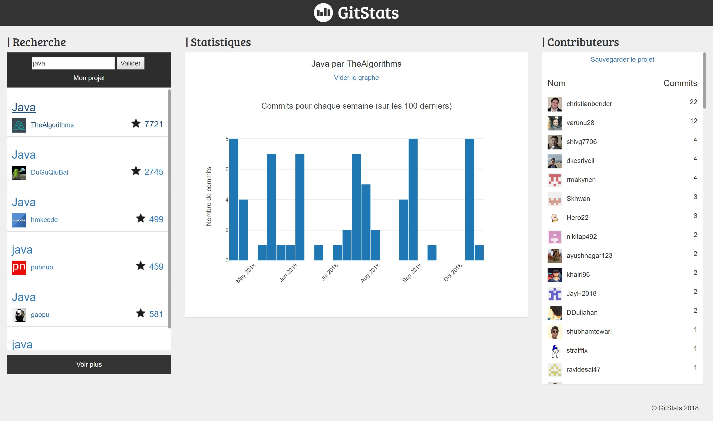

#   GitStats
### Projet en ASP .NET core 2.1
##### + jQuery, Bootstrap, plotly

Cette app permet de rechercher parmis les projets GitHub et d'afficher les 100 derniers "commits" sur le temps ainsi que la liste des contributeurs.

#### En savoir plus

Ce projet utilise l'api GitHub sans authentification. Le nombre de requête est donc limité, je n'ai cependant jamais rencontré cette limite lors du développement.
Le site est responsive, cependant si l'on modifie la taille de la fenêtre il faut recharger la page pour que le graphe s'adapte.
Par défaut, les statistiques des différents projets se superposent (ce qui permet de les comparer). Pour ne visualiser qu'une seule statistique à la fois, utilisez le bouton "vider le graphe".
